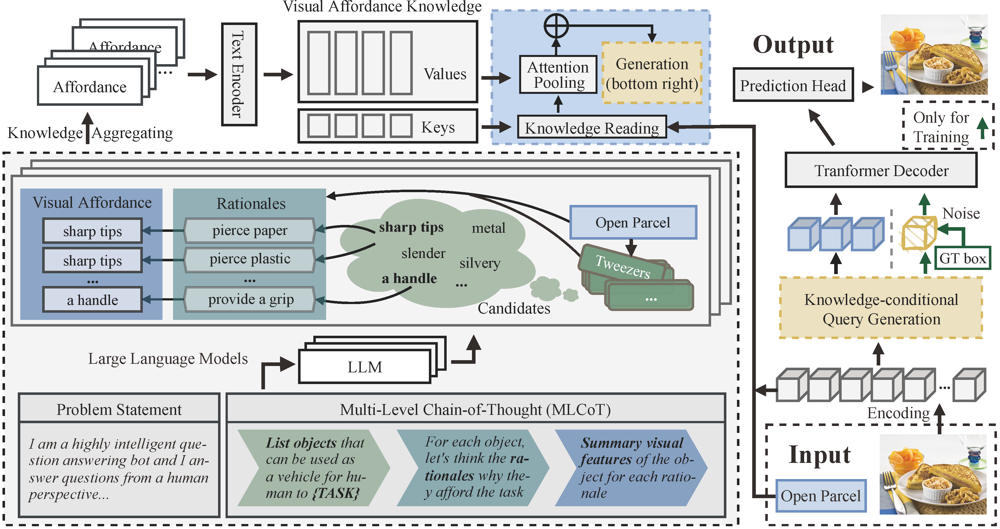

CoTDet: Affordance Knowledge Prompting for Task Driven Object Detection
========

[Jiajin Tang*](https://toneyaya.github.io/), Ge Zheng*, [Jingyi Yu](https://vic.shanghaitech.edu.cn/vrvc/en/people), and [Sibei Yang](https://faculty.sist.shanghaitech.edu.cn/yangsibei/). *denotes equal contribution. This repository is the official implementation of our [CoTDet](https://arxiv.org/abs/2309.01093).

***

## Overview
In this paper, we focus on challenging task driven object detection, which is practical in the real world yet underexplored. To bridge the gap between abstract task requirements and objects in the image, we propose to explicitly extract visual affordance knowledge for the task and detect objects having consistent visual attributes to the visual knowledge. Furthermore, our CoTDet utilizes visual affordance knowledge to condition the decoder in localizing and recognizing suitable objects.





***


## Getting Strated
**1. Prepare the code and the environment**
Git clone our repository, creating a python environment and activate it via the following command
``` bash
# clone repository
git clone https://github.com/Toneyaya/CoTDet.git
# create conda environment
cd CoTDet
conda env create -f environment.yaml
# install detectron2 
python -m pip install -e detectron2
# install MultiScaleDeformableAttention
cd cotdet/modeling/pixel_encoder/ops
sh make.sh
```
**2. Download the [images](https://github.com/coco-tasks/dataset?tab=readme-ov-file#image-lists) and place them (both train and test) in the directory:**
```
CoTDet
├── datasets
  ├── coco-tasts
    ├── annotations
    ├── images
      ├── 1.jpg
      ├── 2.jpg
      ├── 3.jpg
      ├── ...
```
**3. Download our pre-trained [weights](https://drive.google.com/file/d/1gbLC1obJg9rYFwdTquwLiRJb22nj9nuQ/view?usp=sharing) which is pre-trained on a subset of the coco data removing all images that are duplicates of coco-tasks. Then put the pretrain weight path [here](configs/COCOTASK_R101.yaml#3) at line 3.**
***
## Training

```python
OPENBLAS_NUM_THREADS=1 python train_net.py --num-gpus 8 --config-file configs/COCOTASK_R101.yaml
```

### Evaluation
You can download our model [here](https://drive.google.com/file/d/16mlb35W94smyPYMcAv2LhEaLXRCEsWJn/view?usp=sharing) and enter the paths for evaluation. Of course, you can also evaluate your training results in the same way.
```python
OPENBLAS_NUM_THREADS=1 python train_net.py --num-gpus 8 --config-file configs/COCOTASK_R101.yaml --eval-only MODEL.WEIGHT ckpt_path
```
***
## Results
**Object detection results on COCO-Tasks dataset.** \* indicates the evaluation results of release weight.
| Method  | Task1  | Task2  | Task3  | Task4  | Task5  | Task6  | Task7  | Task8  | Task9  | Task10 | Task11 | Task12 | Task13 | Task14 | Avg    |
| ------- | ------ | ------ | ------ | ------ | ------ | ------ | ------ | ------ | ------ | ------ | ------ | ------ | ------ | ------ | ------ |
| GGNN    | 36.6   | 29.8   | 40.5   | 37.6   | 41.0   | 17.2   | 43.6   | 17.9   | 21.0   | 40.6   | 22.3   | 28.4   | 39.1   | 40.7   | 32.6   |
| TOIST   | 45.8   | 40.0   | 49.4   | 49.6   | 53.4   | 26.9   | 58.3   | 22.6   | 32.5   | 50.0   | 35.5   | 43.7   | 52.8   | 56.2   | 44.1   |
| CoTDet  | 58.9   | 55.0   | 51.2   | 68.5   | 60.5   | 47.7   | 76.9   | 40.7   | 47.4   | 66.5   | 41.9   | 48.3   | 61.7   | 71.4   | 56.9   |
| CoTDet* | 62.962 | 54.534 | 53.020 | 62.426 | 66.486 | 49.404 | 74.877 | 46.025 | 50.449 | 66.916 | 51.278 | 52.880 | 70.419 | 75.049 | 59.766 |

***

**Instance segmentatio results on COCO-Tasks dataset.** \* indicates the evaluation results of release weight.
| Method  | Task1  | Task2  | Task3  | Task4  | Task5  | Task6  | Task7  | Task8  | Task9  | Task10 | Task11 | Task12 | Task13 | Task14 | Avg    |
| ------- | ------ | ------ | ------ | ------ | ------ | ------ | ------ | ------ | ------ | ------ | ------ | ------ | ------ | ------ | ------ |
| GGNN    | 31.8   | 28.6   | 45.4   | 33.7   | 46.8   | 16.6   | 37.8   | 15.1   | 15.0   | 49.9   | 24.9   | 18.9   | 49.8   | 39.7   | 32.4   |
| TOIST   | 40.8   | 36.5   | 48.9   | 37.8   | 43.4   | 22.1   | 44.4   | 20.3   | 26.9   | 48.1   | 31.8   | 34.8   | 51.5   | 46.3   | 38.8   |
| CoTDet  | 55.0   | 51.6   | 51.2   | 57.7   | 60.1   | 43.1   | 65.9   | 40.4   | 45.4   | 64.8   | 40.4   | 48.7   | 61.7   | 64.4   | 53.6   |
| CoTDet* | 57.773 | 51.467 | 53.094 | 52.431 | 66.205 | 45.676 | 64.104 | 44.021 | 46.401 | 66.465 | 49.655 | 49.380 | 71.157 | 66.027 | 55.990 |

***
If you find our work helpful for your research, please consider citing the following BibTeX entry.

```BibTeX
@InProceedings{Tang_2023_ICCV,
    author    = {Tang, Jiajin and Zheng, Ge and Yu, Jingyi and Yang, Sibei},
    title     = {CoTDet: Affordance Knowledge Prompting for Task Driven Object Detection},
    booktitle = {Proceedings of the IEEE/CVF International Conference on Computer Vision (ICCV)},
    month     = {October},
    year      = {2023},
    pages     = {3068-3078}
}
```

## Acknowledgement

Many thanks to these excellent opensource projects 
* [detectron2](https://github.com/facebookresearch/detectron2).
* [DN-DETR](https://github.com/IDEA-Research/DN-DETR)
* [MaskDINO](https://github.com/IDEA-Research/MaskDINO)

